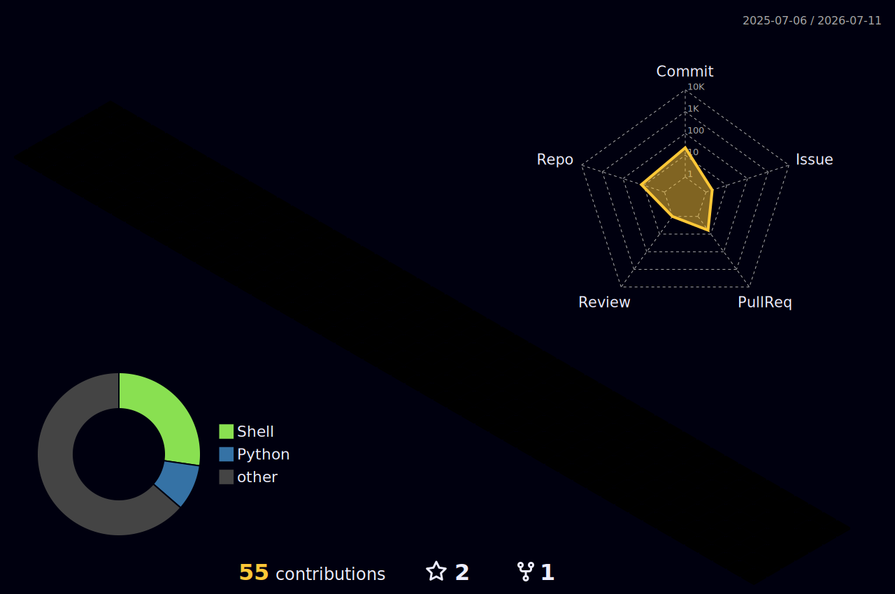

## Hi there 👋

- 🔭 I’m currently working on new projects
- 🌱 I’m currently learning Python and Shell
- 📫 How to reach me: rishichitnis007@gmail.com
- 😄 Pronouns: he/him
- ⚡ Fun fact: I am a ☕️ dependent person

<!--START_SECTION:activity-->
1. 🎉 Merged PR [#2](https://github.com/rishichitnis007-sys/rishichitnis007-sys/pull/2) in [rishichitnis007-sys/rishichitnis007-sys](https://github.com/rishichitnis007-sys/rishichitnis007-sys)
2. 💪 Opened PR [#2](https://github.com/rishichitnis007-sys/rishichitnis007-sys/pull/2) in [rishichitnis007-sys/rishichitnis007-sys](https://github.com/rishichitnis007-sys/rishichitnis007-sys)
3. 🔒 Closed issue [#2](https://github.com/rishichitnis007-sys/dotfiles/issues/2) in [rishichitnis007-sys/dotfiles](https://github.com/rishichitnis007-sys/dotfiles)
4. ℹ️ Assigned issue [#2](https://github.com/rishichitnis007-sys/dotfiles/issues/2) in [rishichitnis007-sys/dotfiles](https://github.com/rishichitnis007-sys/dotfiles)
5. ❗ Opened issue [#2](https://github.com/rishichitnis007-sys/dotfiles/issues/2) in [rishichitnis007-sys/dotfiles](https://github.com/rishichitnis007-sys/dotfiles)
6. 🔒 Closed issue [#1](https://github.com/rishichitnis007-sys/dotfiles/issues/1) in [rishichitnis007-sys/dotfiles](https://github.com/rishichitnis007-sys/dotfiles)
7. 🗣 Commented on [#1](https://github.com/rishichitnis007-sys/dotfiles/issues/1#issuecomment-4906095860) in [rishichitnis007-sys/dotfiles](https://github.com/rishichitnis007-sys/dotfiles)
<!--END_SECTION:activity-->

